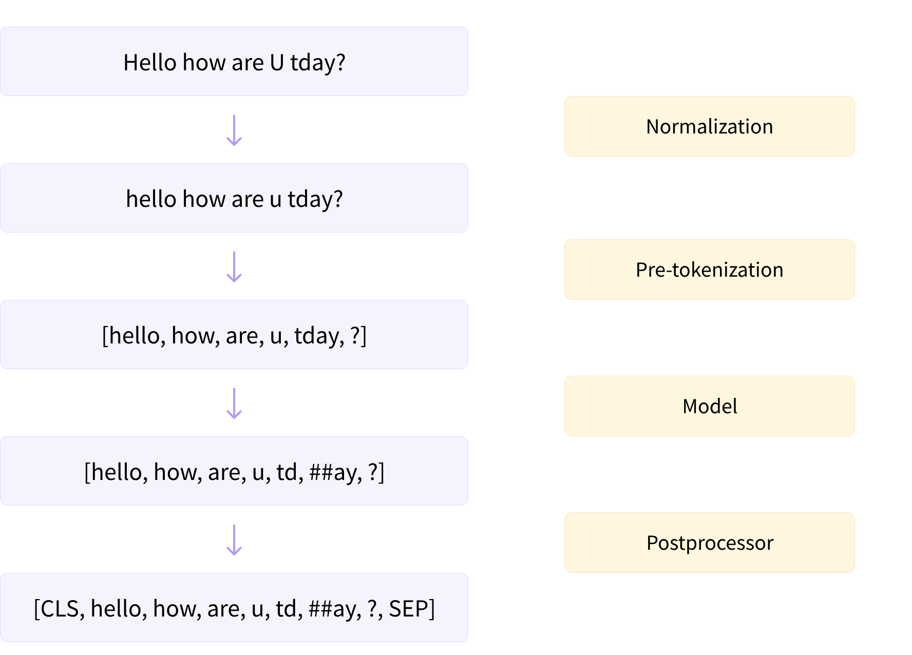

## 一、分词的基本概念

在自然语言处理（NLP）技术中，`Tokenization`也可以被称为“word segmentation”，直译为中文是指`分词`。
具体来讲，分词是NLP的基础任务，按照特定需求能把文本中的句子、段落切分成一个字符串序列（其中的元素通常称为token 或叫词语），作为大语言模型的输入数据。
这些Tokens可以是单个字符、单词的一部分，甚至是整个单词或句子片段。

### 1.1 模型输入（编码 Encode）阶段
由于神经网络模型不能直接处理文本，因此需要先将文本转换为数字，这个过程被称为编码 (Encoding)，其包含两个步骤：

+ **分词（Tokenize）**： 将文本拆分为词元（Token），常见的分词方式包括字级、词级、子词级（如 BPE、WordPiece）、空格分词等。
```
输入: "你好世界"
分词: ["你好", "世界"]
```
+ **映射（Mapping）**：将每个词元映射为词汇表中唯一的 Token ID，生成的数字序列即为模型的输入。
```
分词: ["你好", "世界"]
映射: [1001, 1002]
```

### 1.2 模型输出（解码 Decode）阶段

解码是编码的逆过程，旨在将模型输出的数字序列重新转换为人类可读的文本格式。它也包含两个步骤：

+ **反映射（De-mapping）**：模型输出的数字序列通过词汇表映射回对应的词元，二者是一一对应的关系。
```
输出: [1001, 1002]
反映射: ["你好", "世界"]
```

+ **文本重组**：将解码后的词元以某种规则重新拼接为完整文本。
```
反映射: ["你好", "世界"]
重组: "你好世界"
```

## 二、分词流程
分词的流程通常包括标准化（Normalization）、预分词（Pre-tokenization）、Model和Post-tokenization。



### 2.1 标准化（normalization）

Normalization主要包括以下几个方面：

+ **文本清洗**<br>
 去除无用字符：移除文本中的特殊字符、非打印字符等，只保留对分词和模型训练有意义的内容。<br>
 去除额外空白：消除文本中多余的空格、制表符、换行符等，统一文本格式。<br>

+ **标准化写法**<br>
统一大小写：将所有文本转换为小写或大写，减少大小写变体带来的影响。<br>
数字标准化：将数字统一格式化，有时候会将所有数字替换为一个占位符或特定的标记，以减少模型需要处理的变量数量。<br>

+ **编码一致性**<br>
字符标准化：确保文本采用统一的字符编码（如UTF-8），处理或转换特殊字符和符号。

+ **语言规范化**<br>
词形还原（Lemmatization）：将单词还原为基本形式（lemma），例如将动词的过去式还原为一般现在时。<br>
词干提取（Stemming）：去除单词的词缀，提取词干，这是一种更粗糙的词形还原方式。<br>

```python
from tokenizers.normalizers import BertNormalizer
from transformers import AutoTokenizer, BertTokenizerFast

tokenizer: BertTokenizerFast = AutoTokenizer.from_pretrained("bert-base-uncased")
normalizer: BertNormalizer = tokenizer.backend_tokenizer.normalizer
# hello how are u?
print(normalizer.normalize_str("Héllò hôw are U?"))
```

### 2.2 预分词（Pre-tokenization）

Pre-tokenization是基于一些简单的规则（如空格和标点）进行初步的文本分割，这一步骤是为了将文本初步拆解为更小的单元，如句子和词语；对于英文等使用空格分隔的语言来说，这一步相对直接，但对于中文等无空格分隔的语言，则可能直接进入下一步。


## Model

Model是分词的核心部分，在Pre-tokenization的基础上，根据选定的模型或算法（BPE，WordPiece，Unigram语言模型（LM）或SentencePiece等）进行更细致的处理，包括通过大量文本数据，根据算法规则生成词汇表(Vocabulary)，然后依据词汇表，将文本拆分为Token。

在自然语言处理模型中，确定合适的词汇表大小是一个关键步骤，它直接影响模型的性能、效率以及适应性。理想的词汇表应该在保证模型性能和效率的同时，满足特定任务和数据集的需求。

## Post-tokenization

Post-tokenization主要包括：

- **序列填充与截断**：为保证输入序列的长度一致，对过长的序列进行截断，对过短的序列进行填充。
- **特殊Token添加**：根据模型需求，在序列的适当位置添加特殊Token（如[CLS], [SEP]）。
- **构建注意力掩码**：对于需要的模型，构建注意力掩码以区分实际Token和填充Token。


## 三、分词算法


根据切分粒度的不同，分词策略可以分为以下几种：

按词切分 (Word-based)

word_based_tokenization

例如直接利用 Python 的 split() 函数按空格进行分词：

tokenized_text = "Jim Henson was a puppeteer".split()
print(tokenized_text)
['Jim', 'Henson', 'was', 'a', 'puppeteer']
这种策略的问题是会将文本中所有出现过的独立片段都作为不同的 token，从而产生巨大的词表。而实际上很多词是相关的，例如 “dog” 和 “dogs”、“run” 和 “running”，如果给它们赋予不同的编号就无法表示出这种关联性。

词表就是一个映射字典，负责将 token 映射到对应的 ID（从 0 开始）。神经网络模型就是通过这些 token ID 来区分每一个 token。

当遇到不在词表中的词时，分词器会使用一个专门的 
 token 来表示它是 unknown 的。显然，如果分词结果中包含很多 
 就意味着丢失了很多文本信息，因此一个好的分词策略，应该尽可能不出现 unknown token。

按字符切分 (Character-based)

character_based_tokenization

这种策略把文本切分为字符而不是词语，这样就只会产生一个非常小的词表，并且很少会出现词表外的 tokens。

但是从直觉上来看，字符本身并没有太大的意义，因此将文本切分为字符之后就会变得不容易理解。这也与语言有关，例如中文字符会比拉丁字符包含更多的信息，相对影响较小。此外，这种方式切分出的 tokens 会很多，例如一个由 10 个字符组成的单词就会输出 10 个 tokens，而实际上它们只是一个词。

因此现在广泛采用的是一种同时结合了按词切分和按字符切分的方式——按子词切分 (Subword tokenization)。

**按子词切分 (Subword) **

高频词直接保留，低频词被切分为更有意义的子词。例如 “annoyingly” 是一个低频词，可以切分为 “annoying” 和 “ly”，这两个子词不仅出现频率更高，而且词义也得以保留。下图展示了对 “Let’s do tokenization!“ 按子词切分的结果：

bpe_subword

可以看到，“tokenization” 被切分为了 “token” 和 “ization”，不仅保留了语义，而且只用两个 token 就表示了一个长词。这种策略只用一个较小的词表就可以覆盖绝大部分文本，基本不会产生 unknown token。尤其对于土耳其语等黏着语，几乎所有的复杂长词都可以通过串联多个子词构成。

#### BPE 分词
在 1994 年，BPE 算法被提出，最早用于通用的数据压缩。
随后，自然语言处理领域的研究人员将其进行适配，并应用于文本分词。
BPE 算法从一组基本符号（例如字母和边界字符）开始，迭代地寻找语料库中的两个相邻词元，并将它们替换为新的词元，这一过程被称为`合并`。
合并的选择标准是计算两个连续词元的共现频率，也就是每次迭代中，最频繁出现的一对词元会被选择与合并。
合并过程将一直持续达到预定义的词表大小。

字节级别的 BPE（Byte-level BPE, B-BPE）是 BPE 算法的一种拓展。
它将字节视为合并操作的基本符号，从而可以实现更细粒度的分割，且解决了未登录词问题。
具体来说，如果将所有 Unicode 字符都视为基本字符，那么包含所有可能基本字符的基本词表会非常庞大（例如将中文的每个汉字当作一个基本字符）。
而将字节作为基本词表可以设置基本词库的大小为 256，同时确保每个基本字符都包含在词汇中。 
例如，GPT-2 的词表大小为 50,257 ，包括 256 个字节的基本词元、一个特殊的文末词元以及通过 50,000 次合并学习到的词元。

#### WordPiece 分词
WordPiece 是谷歌内部非公开的分词算法，最初是由谷歌研究人员在开发语音搜索系统时提出的。
随后，在 2016 年被用于机器翻译系统，并于 2018 年被 BERT 采用作为分词器。
WordPiece 分词和 BPE 分词的想法非常相似，都是通过迭代合并连续的词元，但是合并的选择标准略有不同。
在合并前，`WordPiece`分词算法会首先训练一个语言模型，并用这个语言模型对所有可能的词元对进行评分。然后，在每次合并时，它都会选择使得训练数据的似然性增加最多的词元对。
与 BPE 类似，Word Piece 分词算法也是从一个小的词汇表开始，其中包括模型使用的特殊词元和初始词汇表。
由于它是通过添加前缀（如 BERT 的##）来识别子词的，因此每个词的初始拆分都是将前缀添加到词内的所有字符上。
举例来说，“word”会被拆分为：“w##o ##r ##d”。与 BPE 方法的另一个不同点在于，WordPiece 分词算法并不选择最频繁的词对，而是使用下面的公式为每个词对计算分数：

$$
得分=\frac{词对出现的频率}{第一个词出现的频率\times 第二个词出现的频率} \\
$$

#### Unigram 分词
与 BPE 分词和 WordPiece 分词不同，Unigram 分词方法从语料库的一组足够大的字符串或词元初始集合开始，迭代地删除其中的词元，直到达到预期的词表大小。
它假设从当前词表中删除某个词元，并计算训练语料的似然增加情况，以此来作为选择标准。
这个步骤是基于一个训练好的一元语言模型来进行的。
为估计一元语言模型，它采用期望最大化（Expectation–Maximization, EM）算法：
在每次迭代中，首先基于旧的语言模型找到当前最优的分词方式，然后重新估计一元概率从而更新语言模型。
这个过程中一般使用动态规划算法（即`维特比算法`，Viterbi Algorithm）来高效地找到语言模型对词汇的最优分词方式。采用这种分词方法的代表性模型包括 T5 和 mBART。


#### 分词器的选用
虽然直接使用已有的分词器较为方便（例如 OPT和 GPT-3使用了 GPT-2的分词器），但是使用为预训练语料专门训练或设计的分词器会更加有效，尤其是对于那些混合了多领域、多语言和多种格式的语料。
最近的大语言模型通常使用 SentencePiece 代码库为预训练语料训练定制化的分词器，这一代码库支持字节级别的 BPE 分词和 Unigram 分词。

首先，分词器必须具备无损重构的特性，即其分词结果能够准确无误地还原为原始输入文本。其次，分词器应具有高压缩率，即在给定文本数据的情况下，经过分词处理后的词元数量应尽可能少，从而实现更为高效的文本编码和存储。具体来说，压缩比可以通过将原始文本的 UTF-8 字节数除以分词器生成的词元数（即每个词元的平均字节数）来计算：

$$
压缩率=\frac{UTF-8字节数}{词元数} \\
$$

值得注意的是，在扩展现有的大语言模型（如继续预训练或指令微调）的同时，还需要意识到原始分词器可能无法较好地适配实际需求。
此外，为进一步提高某些特定能力（如数学能力），还可能需要针对性地设计分词器。例如，BPE 分词器可能将整数 7,481 分词为“7 481”，而将整数 74,815 分词为“748 15”。


## 参考引用
1. [BPE vs WordPiece：理解Tokenizer的工作原理与子词分割方法](https://github.com/Hoper-J/AI-Guide-and-Demos-zh_CN/blob/master/Guide/21. BPE vs WordPiece：理解 Tokenizer 的工作原理与子词分割方法.md)<br>
2. [第三篇：ChatGPT背后强大而神秘的力量，用最简单的语言讲解Transformer架构之Tokenizer](https://zhuanlan.zhihu.com/p/686444517)<br>

【LLM基础知识】LLMs-Tokenizer知识总结笔记v2.0
https://www.53ai.com/news/LargeLanguageModel/2024080625837.html
全网最全的大模型分词器（Tokenizer）总结.md
https://github.com/luhengshiwo/LLMForEverybody/blob/main/01-第一章-预训练/全网最全的大模型分词器（Tokenizer）总结.md

transformers-tokenizer
https://huggingface.co/learn/nlp-course/zh-CN/chapter6/1?fw=pt
https://github.com/huggingface/tokenizers
LLM中的Tokenizers
https://www.bilibili.com/video/BV1q94y1a7NU
https://www.huaxiaozhuan.com/%E5%B7%A5%E5%85%B7/huggingface_transformer/chapters/1_tokenizer.html
openai-tokenizer
https://zhuanlan.zhihu.com/p/592399697
tiktokenizer-可视化
https://github.com/openai/tiktoken/blob/main/README.md
https://tiktokenizer.vercel.app/
千问-tokenizer
https://github.com/QwenLM/Qwen/blob/main/tokenization_note_zh.md
FastTokenizer：高性能文本处理库
https://github.com/GreatV/fast_tokenizer
