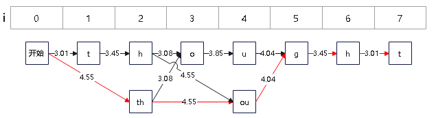

## 一、维特比算法
维特比算法（Viterbi algorithm）是一种动态规划算法。用于寻找最有可能产生观测事件序列的维特比路径——隐含状态序列，特别是在马尔可夫信息源上下文和隐马尔可夫模型中。
核心思想是：
+ **动态规划递推**：通过逐步计算每个位置的最优子路径，避免重复计算。
+ **路径回溯**：通过记录每个节点的最优前驱路径，最终回溯得到全局最优解。

### 1.1 分词
#### 1.1.1 N-元语言模型
 **n元语言模型**是一种概率模型，用于预测一个句子的概率。它基于前 $n-1$ 个词来预测第 $n$ 个词的概率。该模型的基本假设是当前词的出现仅依赖于前面的 $n-1$ 个词。


- **Unigram 模型**：考虑单个词的概率，忽略上下文信息。<br>
  概率公式： $P(w_i)$ <br>
  句子的概率为每个单词概率的乘积： $P(S)=\prod_{i=1}^{n} P(w_i)$

- **Bigram 模型**：考虑当前词与其直接前一个词共同出现的概率。<br>
  条件概率公式： $P(w_i|w_{i-1})$ <br>
  句子的概率为相邻词对条件概率的乘积： $P(S)=\prod_{i=2}^{n}P(w_i|w_{i-1})$

似然函数衡量给定数据集在特定参数下的可能性。对于语言模型，这通常涉及最大化训练语料库上的似然。
- Unigram： $\mathcal{L} = \prod_{s \in D} \prod_{w \in s} P(w)$
- Bigram： $\mathcal{L} = \prod_{s \in D} \prod_{i=2}^{|s|} P(w_i|w_{i-1})$

为了便于优化，我们通常使用负对数似然作为损失函数：
- Unigram： $\text{Loss} = -\sum_{s \in D} \sum_{w \in s} \log(P(w))$
- Bigram：  $\text{Loss} = -\sum_{s \in D} \sum_{i=2}^{|s|} \log(P(w_i|w_{i-1}))$

#### 1.1.2 维特比算法求解
核心思路：通过动态规划（DP）维护每个位置的最优分词路径及累积概率，结合子词概率进行计算。
+ 数组dp[i]: 表示从开始到达位置 i 时的最大概率。 
+ 数组path[i]: 表示从开始到达位置 i 时的分词路径。例如，path[i]=j表示以j为开始下标、i为结束下标的词元。

具体步骤如下：
1. 初始化：dp[0] 初始概率为0，路径为空。
2. 递推计算：遍历每个位置 i，尝试所有可能的前驱位置 j，计算候选词的条件概率。
3. 路径记录：保存最大概率对应的分词路径。
4. 回溯最优解：最终 dp[n] 中的路径即为最优分词结果。

Python实现示例：
```python
def viterbi(word: str, model: Dict[str, float]) -> Tuple[List[str], int]:
    """
    Viterbi算法（动态规划）
    :param word: 字符串
    :param model:  子词对应的概率
    :return:
    """
    n = len(word)
    dp = [float("inf")] * (n + 1)
    path = [-1] * (n + 1)
    dp[0] = 0

    # 动态规划求解
    for i in range(1, n + 1):
        for j in range(i):
            token = word[j: i]
            if token in model:
                score = dp[j] + model[token]
                if score < dp[i]:
                    dp[i] = score
                    path[i] = j
    if path[-1] == -1:
        return ["<unk>"], None

    # 回溯得到最优切分方式
    optimal_split = []
    i = n
    while i > 0:
        prev = path[i]
        optimal_split.append(word[prev:i])
        i = prev
    optimal_split.reverse()
    return optimal_split, dp[n]


_word = "thought"
_model = {'h': 3.45, 't': 3.01, 'u': 3.85, 'g': 4.04, 'o': 3.08, 'th': 4.55, 'ou': 4.55}
_optimal_split, _score = viterbi(_word, _model)
# 最优切分方式: ['th', 'ou', 'g', 'h', 't']
# 最小得分之和: 19.6
print("最优切分方式:", _optimal_split)
print("最小得分之和:", _score)
```
图示：在效率方面相对于粗暴地遍历所有路径，viterbi 维特比算法到达每一列的时候都会删除不符合最短路径要求的路径，大大降低时间复杂度。（红色线保留、黑色线删除）



## 二、EM算法
EM算法，指的是最大期望算法（Expectation Maximization Algorithm，又译期望最大化算法），是一种迭代算法。
EM 算法是 Dempster, Laind, Rubin 于 1977 年提出的求参数极大似然估计的一种方法，它可以从非完整数据集中对参数进行 MLE 估计，是一种非常简单实用的学习算法。
这种方法可以广泛地应用于处理缺损数据，截尾数据，带有噪声等所谓的不完全数据。

假设我们估计两个参数A和B，在开始状态下二者都是未知的，并且知道了A的信息就可以得到B的信息，反过来知道了B也就得到了A。
可以考虑首先赋予A某种初值，以此得到B的估计值，然后从B的当前值出发，重新估计A的取值，这个过程一直持续到收敛为止。

直观地理解EM算法，它也可被看作为一个逐次逼近算法：事先并不知道模型的参数，可以随机的选择一套参数或者事先粗略地给定某个初始参数，确定出对应于这组参数的最可能的状态，计算每个训练样本的可能结果的概率，在当前的状态下再由样本对参数修正，重新估计参数 $\theta$，并在新的参数下重新确定模型的状态，这样，通过多次的迭代，循环直至某个收敛条件满足为止，就可以使得模型的参数逐渐逼近真实参数。

EM算法的主要目的是提供一个简单的迭代算法计算后验密度函数，它的最大优点是简单和稳定，但容易陷入局部最优。

### 2.1 EM算法概念
在统计学中，最大期望（EM）算法是在概率（probabilistic）模型中寻找参数最大似然估计或者最大后验估计的算法，其中概率模型依赖于无法观测的隐藏变量（Latent Variable）。

最大期望算法经过两个步骤交替进行计算：

1. 计算期望（E），利用概率模型参数的现有估计值，计算隐藏变量的期望；
2. 最大化（M），利用E 步上求得的隐藏变量的期望，对参数模型进行最大似然估计。

总体来说，EM的算法流程如下：

1. 初始化分布参数
2. 重复直到收敛：
   - E步骤：估计未知参数的期望值，给出当前的参数估计。
   - M步骤：重新估计分布参数，以使得数据的似然性最大，给出未知变量的期望估计。

### 2.3 EM算法流程
假定集合由观测数据 $X$ 和未观测数据 $Z$ 组成， $Y=(X, Z)$ 称为完整数据，而 $X$ 称为不完整数据。
假设 $Y$ 的联合概率密度被参数化地定义为 $P(Y|\theta)$ ，其中 $\theta$ 表示要被估计的参数。 $\theta$ 的最大似然估计是求不完整数据的对数似然函数的最大值而得到的：

$$
L(\theta) = \log P(X|\theta) = \log \sum_Z P(Y|\theta)
$$

EM算法包括两个步骤：由E步和M步组成，它是通过迭代地最大化完整数据的对数似然函数的期望来最大化不完整数据的对数似然函数，其中：

假设在算法第 $t$ 次迭代后获得的估计记为 $\theta^{(t)}$ ，则在 $(t+1)$ 次迭代时，

- **E-步**：计算完整数据的对数似然函数的期望，记为 $Q(\theta|\theta^{(t)})$ ：
  
$$
Q(\theta|\theta^{(t)}) = \mathbb{E}_Z[\log P(Y|\theta)|X, \theta^{(t)}]
$$

- **M-步**：通过最大化 $Q(\theta|\theta^{(t)})$ 来获得新的 $\theta^{(t+1)}$ 。

通过交替使用这两个步骤，EM算法逐步改进模型的参数，使参数和训练样本的似然概率逐渐增大，最后终止于一个极大点。

## 参考
[1] [文本挖掘的分词原理](https://www.cnblogs.com/pinard/p/6677078.html)<br>
[2] [如何通俗地讲解 viterbi 算法？](https://www.zhihu.com/question/20136144/answer/763021768?utm_psn=1895852064111829755)<br>
[3] [em算法](https://baike.sogou.com/v9130286.htm?ch=frombaikevr&fromTitle=em%E7%AE%97%E6%B3%95)<br>

