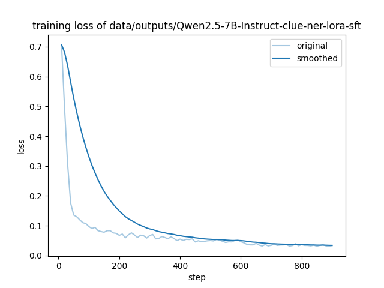

<nav>
<a href="#一环境配置">一、环境配置</a><br/>
<a href="#二准备工作">二、准备工作</a><br/>
&nbsp;&nbsp;&nbsp;&nbsp;<a href="#21-基座模型下载">2.1 基座模型下载</a><br/>
&nbsp;&nbsp;&nbsp;&nbsp;<a href="#22-数据集构建alpaca格式">2.2 数据集构建（alpaca格式）</a><br/>
<a href="#三整体流程">三、整体流程</a><br/>
&nbsp;&nbsp;&nbsp;&nbsp;<a href="#31-配置文件">3.1 配置文件</a><br/>
&nbsp;&nbsp;&nbsp;&nbsp;<a href="#32-训练过程">3.2 训练过程</a><br/>
&nbsp;&nbsp;&nbsp;&nbsp;<a href="#33-vllm部署和调用">3.3 vllm部署和调用</a><br/>
<a href="#四模型评估">四、模型评估</a><br/>
<a href="#参考引用">参考引用</a><br/>
</nav>

## 一、环境配置
docker镜像
```
FROM nvidia/cuda:12.2.2-cudnn8-runtime-ubuntu22.04
```
CUDA版本
```shell
nvcc -V
# Cuda compilation tools, release 12.2, V12.2.140
# Build cuda_12.2.r12.2/compiler.33191640_0
```
LLaMa-Factory版本
```shell
llamafactory-cli version
#----------------------------------------------------------
#| Welcome to LLaMA Factory, version 0.9.2                |
#| Project page: https://github.com/hiyouga/LLaMA-Factory |
#----------------------------------------------------------
```
> 官方文档是 git clone 整个项目以便支持最新的模型。

## 二、准备工作
### 2.1 基座模型下载
```python
from modelscope import snapshot_download
snapshot_download('Qwen/Qwen2.5-7B-Instruct', cache_dir='models', revision='master')
```
### 2.2 数据集构建（alpaca格式）
原始数据
```json lines
{
	"text": "北京城.",  // 表示原始文本
	"label": {
		"NT": {"北京城": [[0, 2]]}  // "label" 表示实体类型（如 NT）及其对应的实体名称和出现的位置索引。
	}
}
```
转换为alpaca格式：data/dataset/alpaca/alpaca_clue_train.json
```
[
  {
    "instruction": "你是一个文本实体识别领域的专家，请从给定的句子中识别并提取出以下指定类别的实体。\n\n<实体类别集合>\nname, organization, scene, company, movie, book, government, position, address, game\n\n<任务说明>\n1. 仅提取属于上述类别的实体，忽略其他类型的实体。\n2. 以json格式输出，对于每个识别出的实体，请提供：\n   - label: 实体类型，必须严格使用原始类型标识（不可更改）\n   - text: 实体在原文中的中文内容\n\n<输出格式要求>\n```json\n[{{\"label\": \"实体类别\", \"text\": \"实体名称\"}}]\n```",
    "input": "浙商银行企业信贷部叶老桂博士则从另一个角度对五道门槛进行了解读。叶老桂认为，对目前国内商业银行而言，",
    "output": "[{\"label\": \"name\", \"text\": \"叶老桂\"}, {\"label\": \"company\", \"text\": \"浙商银行\"}]"
  }
]
```
注册自定义数据集，将数据集添加到全局配置：data/dataset/alpaca/dataset_info.json
```
{
  "alpaca_clue_train": {
    "file_name": "alpaca_clue_train.json"
  }
}
```

## 三、整体流程
### 3.1 配置文件
conf/Qwen2.5-7B-Instruct-clue-ner-lora-sft.yaml
```
### model
model_name_or_path: ../model_hub/Qwen2.5-7B-Instruct
trust_remote_code: true

### method
stage: sft
do_train: true
finetuning_type: lora
flash_attn: auto
lora_rank: 8
lora_target: all

### dataset
dataset_dir: data/dataset/alpaca  # 存储数据集的文件夹路径。
dataset: alpaca_clue_train
template: qwen  # Qwen (1-2.5)
cutoff_len: 1024  # 输入的最大 token 数，超过该长度会被截断。
max_samples: 15000  # 每个数据集的最大样本数：设置后，每个数据集的样本数将被截断至指定的 max_samples。
overwrite_cache: true  # 是否覆盖缓存的训练和评估数据集。
preprocessing_num_workers: 16
dataloader_num_workers: 8

### output
output_dir: data/outputs/Qwen2.5-7B-Instruct-clue-ner-lora-sft
logging_steps: 10
save_steps: 500
plot_loss: true
overwrite_output_dir: true
save_only_model: false

### train
per_device_train_batch_size: 4  # 每设备训练批次大小, 默认 8
gradient_accumulation_steps: 8
learning_rate: 1.0e-4
num_train_epochs: 3.0
lr_scheduler_type: cosine
warmup_ratio: 0.1
bf16: true
ddp_timeout: 180000000
resume_from_checkpoint: null

### eval
#eval_dataset:
val_size: 0.1
per_device_eval_batch_size: 1
eval_strategy: steps
eval_steps: 500
```
### 3.2 训练过程
启动训练：
```shell
llamafactory-cli train conf/Qwen2.5-7B-Instruct-lora-sft.yaml
```
训练时框架会将alpaca格式数据集转换为不同大模型的对话模板，数据示例如下：
+ `inputs`
```
<|im_start|>system
You are a helpful assistant.<|im_end|>
<|im_start|>user
你是一个文本实体识别领域的专家，请从给定的句子中识别并提取出以下指定类别的实体。

<实体类别集合>
name, organization, scene, company, movie, book, government, position, address, game

<任务说明>
1. 仅提取属于上述类别的实体，忽略其他类型的实体。
2. 以json格式输出，对于每个识别出的实体，请提供：
   - label: 实体类型，必须严格使用原始类型标识（不可更改）
   - text: 实体在原文中的中文内容

<输出格式要求>
``json
[{{"label": "实体类别", "text": "实体名称"}}]
``

浙商银行企业信贷部叶老桂博士则从另一个角度对五道门槛进行了解读。叶老桂认为，对目前国内商业银行而言，<|im_end|>
<|im_start|>assistant
[{"label": "name", "text": "叶老桂"}, {"label": "company", "text": "浙商银行"}]<|im_end|>
```
+ `labels`
```
[{"label": "name", "text": "叶老桂"}, {"label": "company", "text": "浙商银行"}]<|im_end|>
```
GPU显存占用情况：
```
|===============================+======================+======================|
|   0  NVIDIA A100-PCI...  Off  | 00000000:65:00.0 Off |                    0 |
| N/A   67C    P0   193W / 250W |  30756MiB / 40536MiB |     48%      Default |
|                               |                      |             Disabled |
+-------------------------------+----------------------+----------------------+
```
训练日志：
```
[INFO|trainer.py:2405] 2025-05-30 02:56:21,267 >> ***** Running training *****
[INFO|trainer.py:2406] 2025-05-30 02:56:21,268 >>   Num examples = 9,673
[INFO|trainer.py:2407] 2025-05-30 02:56:21,268 >>   Num Epochs = 3
[INFO|trainer.py:2408] 2025-05-30 02:56:21,268 >>   Instantaneous batch size per device = 4
[INFO|trainer.py:2411] 2025-05-30 02:56:21,268 >>   Total train batch size (w. parallel, distributed & accumulation) = 32
[INFO|trainer.py:2412] 2025-05-30 02:56:21,268 >>   Gradient Accumulation steps = 8
[INFO|trainer.py:2413] 2025-05-30 02:56:21,268 >>   Total optimization steps = 906
[INFO|trainer.py:2414] 2025-05-30 02:56:21,274 >>   Number of trainable parameters = 20,185,088
....
{"current_steps": 900, "total_steps": 906, "loss": 0.0331, "lr": 1.337e-08, "epoch": 2.979, "percentage": 99.34, "elapsed_time": "1:44:23", "remaining_time": "0:00:41"}
{"current_steps": 906, "total_steps": 906, "epoch": 2.9987598181066555, "percentage": 100.0, "elapsed_time": "1:45:06", "remaining_time": "0:00:00"}
```
loss变化<br>



### 3.3 vllm部署和调用
+ 服务部署
```shell
nohup python -m vllm.entrypoints.openai.api_server \
--host 0.0.0.0 \
--port 8000 \
--model ../model_hub/Qwen2.5-7B-Instruct \
--served-model-name Qwen2.5-7B-Instruct \
--enable-lora \
--gpu-memory-utilization 0.8 \
--max-model-len 1024 \
--disable-log-requests \
--lora-modules clue-ner-lora-sft=data/outputs/Qwen2.5-7B-Instruct-clue-ner-lora-sft \
> server.log &
```
+ 调用示例
```shell
curl http://localhost:8000/v1/chat/completions -H "Content-Type: application/json" -d '{
  "model": "clue-ner-lora-sft",
  "messages": [
    {"role": "system", "content": "你是Qwen，由阿里云创建。你是一个乐于助人的助手。"},
    {"role": "user", "content": "你是谁？"}
  ],
  "temperature": 0.7,
  "top_p": 0.8,
  "repetition_penalty": 1.05,
  "max_tokens": 512
}'
```
## 四、模型评估
```
       Label Precision  Recall     F1
     address    0.6104  0.6154 0.6129
        name    0.8686  0.9091 0.8884
organization     0.814  0.7762 0.7946
        game    0.8484  0.9164 0.8811
       scene    0.6919  0.6432 0.6667
        book    0.8299  0.8026 0.8161
    position    0.8127  0.7859 0.7990
     company    0.8255  0.8142 0.8198
  government    0.8168   0.877 0.8458
       movie    0.8723    0.82 0.8454
  Macro Avg.         -       - 0.7970
  Micro Avg.    0.7986  0.7991 0.7988
```

## 参考引用
[1] [LLaMA-Factory 官网教程](https://llamafactory.readthedocs.io/zh-cn/latest/getting_started/sft.html)<br>
[2] [LLaMA-Factory 参数配置](https://llamafactory.readthedocs.io/zh-cn/latest/advanced/arguments.html)<br>
[3] [LLaMA-Factory 提示词模板](https://github.com/hiyouga/LLaMA-Factory/blob/main/README_zh.md)<br>
